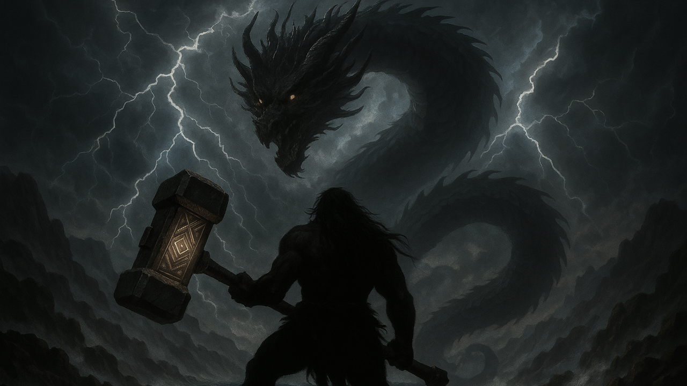

# 단군의 길

 

## 🐻 스토리

> 환웅과 웅녀는 혼인하였고.  
> 그렇게 초대 단군이 탄생하였다.
> 
> 사계절이 여러 번 바뀌었고.  
> 이윽고 17대 단군 선출일이 되었다.
> 
> 환웅의 후손 중 하늘의 시험에 통과한 자는  
> 그 누구든 단군의 자리에 오를 수 있었으니.  
> 많은 이들이 자격을 증명하고자 아사달로 모여들었다.  
> 
> "진헌" 또한 그 중 하나였으나.  
> 그의 목표는 단군의 계승이 아닌. 다른 목적에 있었다.  
> 진헌은 과연 하늘의 시험을 통과할 수 있을까?  

 

## 🎮 포트리스 팀원 소개

| Profile | Name | Major | Role | Development |
|:--------:|:--------:|:--------:|:--------:|:--------:|
|  | 조현우 | 휴먼지능정보공학전공 | 팀장 | 보스 몬스터 **청룡** 개발 |
|  | 조준환 | 게임전공 | 게임 스토리 기획 | 주인공 **진헌** 개발 |
|  | 김민우 | 컴퓨터과학전공 | 프로젝트 통합 관리자 | 스테이지 & UX/UI 개발 |
|  | 강민우 | 휴먼지능정보공학전공 | 게임 컨셉 디자인 | 보스 몬스터 **백호** 개발 |

 

 

 

 

 
